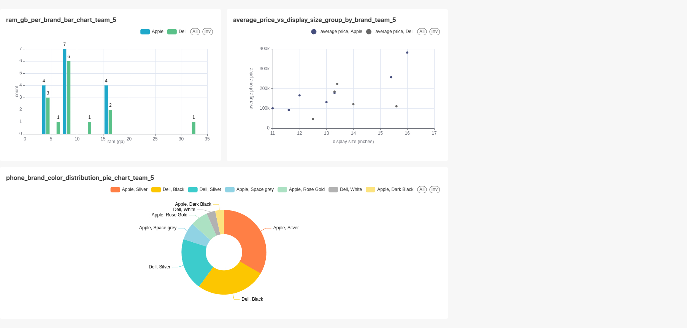

# mts-data-platforms-hw7

----------------------------------------------------------

## Dashboard

В apache Superset был создан дашборд `team-5-hw7dashboard` на основе внешней таблицы из дз 6 (`team_5_external_table_for_spark_csv`)

Дашборд состоит из 3 чартов:
- bar chart с распределением размера оперативной памяти (`ram (gb)`) смартфонов (по OX, на OY - количество), для каждого объёма памяти несколько столбцов - разбиение по брендами смартфонов
- scatter plot с зависимостью средней цены смартфона от размера экрана (`display size (inches)`), аналогично группировка по бренду
- pie chart с распределением смартфонов по паре (бренд, цвет корпуса)

